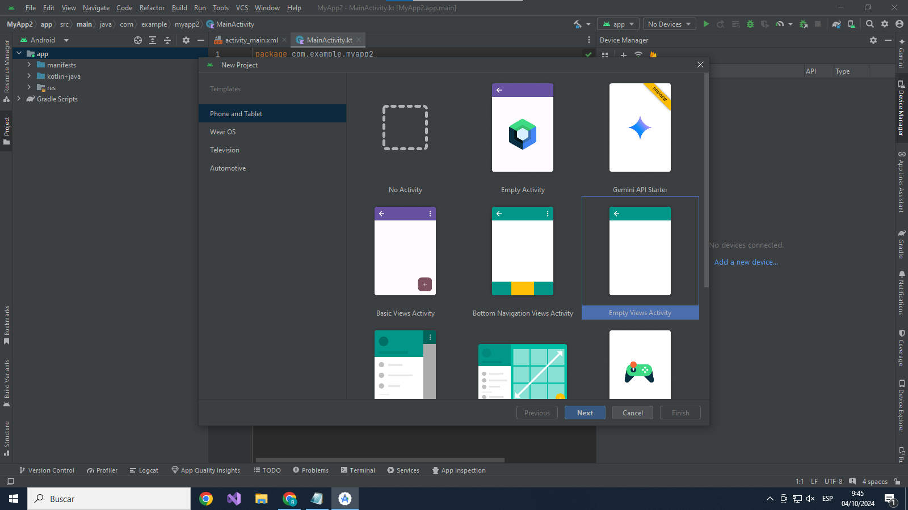

# Manual - Proyecto Final

## Introducción
Proyecto Final consiste en una aplicación que consiste en una calculadora en la cual se pueden resolver operaciones del area de fisica fundamental en la cual se pueden resolver formulas facilmente.

## Objetivos Generales
- Facilita la realizacion de las operaciones en la calculadora.
-  es mas compacto para el usuario a la hora de utilizarlo.

## Objetivos Espesificos
- Que sea una aplicacion campacta para el usuario.
- La aplicacion esta creada para poder resolver las formulas del area cientifica.

## Descripción del Software
Proyecto Final resuelve las formulas de MRU. La primera formula es para encontrar la posicion la cual es, posicion inicial + velocidad * tiempo, la segunda es encontrar distancia la cual es, velocidad * tiempo. estas formulas son las que la calculadora podra calcular de una manera muy compacta y facil de utilizar para el usuario. 

La segunda app que realizamos resuelve las formulas de Hidrostática. la primera formula es para encontrar densidad la cual es, Fuerza / Area, La segunda es encontrar Presion la cual es, masa / Volumen. estas formulas son las que la calculadora podra calcular de una manera muy compacta y facil de comprender para el usuario.

## Recursos Utilizados
1. Android Studio.
2. Windows 10
3. Para emularPixwl 7 API35

### Requisitos Minimos
- API 26 ("Oreo"; Android 8.0)
  
### Flujo de software
- **Paso1:** Creamos nuestro proyecto
  
- **paso2:** Le damos un nombre y version de android
   
- **Contraseña**
- **Confirmar Contraseña**
  
### Registro de Compras
- **Nombre**
- **Correo electronico**
- **Pelicula**
- **Horario**
- **Sala**
- **NIT**
- **Numero de trajeta**
- **Fecha de Expiracion**
- **CVV**
  
## Requisitos Técnicos
1. Starlight Cinema debe tener backend, frontend y gestor de datos con MYSQL.
2. Acceso a un sitio web.
3. Internet para la facturacion.

## Uso de la Aplicación
### Acceso y Registro
1. **Inicio de sesión**: Ingrese su correo electrónico y contraseña.
2. **Registro de nuevo usuario**: Complete el formulario de registro con los datos solicitados.

### Gestión de Usuarios
1. **Administrador**: Puede agregar o eliminar usuarios y administradores secundarios.

## Capturas de Pantalla y Descripción
Proporcione capturas de pantalla de las principales funcionalidades y descripciones detalladas para guiar a los usuarios en el uso de la aplicación.
1. **Pagina principal**
   
   - Carusel sobre las peliculas que estan disponibles.
   
   
   - Cartelera en la cual se muestra las peliculas que pueden escoger. 
   

   - Se muestran las ubicaciones en las cuales estan nuestro cine.
   

   - Visualización de la misión y visión de nuestro proyecto.
   

   - visualización del pie de pagina donde se muestra las redes sociales y el logo.
   
   
3. **Pagina sobre nosotros**
   - Explicación de el proposito del proyecto.  
   

5. **Login**
   
   - Podemos ingresar como usuario o registrarse.
   

7. **Pagina compra**
   
   - Escogemos la pelicula desea y precionamos el boton de compra.
    

   - Llenamos los campos requeridos para realizar la compra. 
    

   - Seleccion de los asientos que desee el usuario. 
    

   - Confirmacion de la compra con exito.
    

9. **Pagina facturaciòn**

   - Visualizacion de la factura que se le envia al usuario.
    

11. **Pagina vista administrador**

    - Interfaz para agregar, eliminar y modificar las peliculas.
    

    - interfaz para agregar, eliminar administradores secundarios. 
    

    - Visualización de los usuarios Agregados.
    

