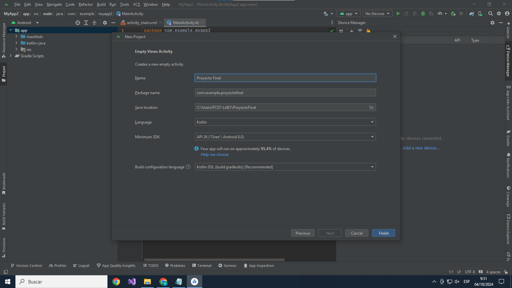

# Manual - Proyecto Final

## Introducción
El proyecto final consiste en una aplicación que funciona como una calculadora para resolver operaciones del área de física fundamental, en la cual se pueden resolver fórmulas fácilmente.

## Objetivos Generales
- Facilita la realización de las operaciones en la calculadora.
- Es más compacto para el usuario a la hora de utilizarlo."

## Objetivos Espesificos
-Que sea una aplicación compacta para el usuario.
-La aplicación está creada para poder resolver las fórmulas del área científica.

## Descripción del Software
El proyecto final resuelve las fórmulas de MRU. La primera fórmula es para encontrar la posición, que se calcula como posición inicial + velocidad × tiempo. La segunda fórmula permite encontrar la distancia, que es velocidad × tiempo. Estas fórmulas son las que la calculadora podrá calcular de una manera muy compacta y fácil de utilizar para el usuario.

La segunda aplicación que realizamos resuelve las fórmulas de hidrostática. La primera fórmula es para encontrar la densidad, que se calcula como fuerza / área. La segunda fórmula permite encontrar la presión, que es masa / volumen. Estas fórmulas son las que la calculadora podrá calcular de una manera muy compacta y fácil de comprender para el usuario.

## Recursos Utilizados
1. Android Studio.
2. Windows 10
3. Para emular: Pixel 7 API35

### Requisitos Minimos
- API 26 ("Oreo"; Android 8.0)
  
### Flujo de software
- Paso1: Creamos nuestro proyecto.
  
- Paso2: Le damos un nombre y version de android.
   
- Paso3:Creamos los diseños de nuestras caluladoras.
- 
   
   
- **Paso4:**Codificacion para darle las funciones a la calculadora de RMU
   
  
